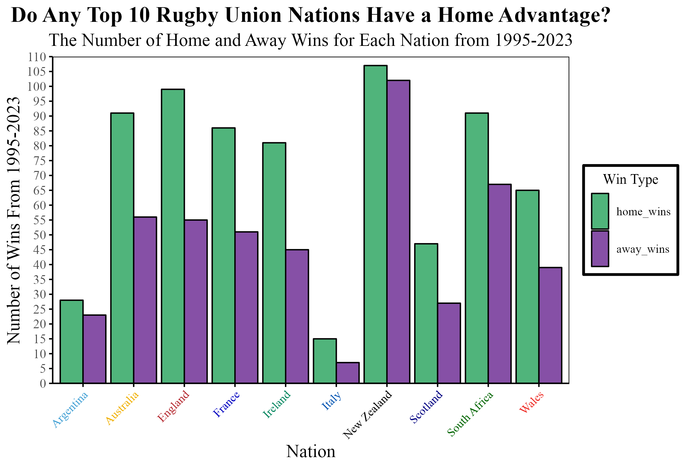

## Project Introduction and Research Question

For my PSY6422 project, I chose a dataset based on a personal interest of mine - rugby union. After exploring several open dataset websites, I came across the one I will be analysing on Kaggle "*International Rugby Union results from 1871-2023*". I chose to investigate the existence of a home advantage as it is a topic of discussion in all sports and this dataset had information I could use to unravel this concept in rugby union.

The research question that I formulated from this dataset is "**Do any of the top 10 Rugby Union Nations have a home advantage?**. This would hopefully be answered by investigating the amount of home wins each country had against the other nations as opposed to away wins. The Top 10 Nations (according to this dataset and World Rugby - 'https://www.world.rugby/rankings') are **South Africa, Ireland, New Zealand, France, England, Scotland, Argentina, Wales, Australia** and **Italy**.

## Data Origins

I obtained this dataset from Kaggle. The link to the dataset is **https://www.kaggle.com/datasets/lylebegbie/international-rugby-union-results-from-18712022**. The original data came from a series of Wikipedia pages reporting all fixtures between these countries. The links to all of these pages are listed below under **"Data Sources"**. The author then organised the variables and dataset themselves, based on the information provided on the Wikipedia pages. 
The variable labels and the information they describe are found in the codebook.txt file in the notes section.

## Data Sources

The links below lead to Wikipedia pages on historical fixture information between each country and the other top 10 nations. 

**England v Ireland** = https://en.wikipedia.org/wiki/History_of_rugby_union_matches_between_England_and_Ireland

**England v France** = https://en.wikipedia.org/wiki/History_of_rugby_union_matches_between_England_and_France

**England v Italy** = https://en.wikipedia.org/wiki/History_of_rugby_union_matches_between_England_and_Italy

**England v Scotland** = https://en.wikipedia.org/wiki/History_of_rugby_union_matches_between_England_and_Scotland

**England v Wales** = https://en.wikipedia.org/wiki/History_of_rugby_union_matches_between_England_and_Wales

**England v Australia** = https://en.wikipedia.org/wiki/History_of_rugby_union_matches_between_Australia_and_England

**England v New Zealand** = https://en.wikipedia.org/wiki/History_of_rugby_union_matches_between_England_and_New_Zealand

**England v Argentina** = https://en.wikipedia.org/wiki/History_of_rugby_union_matches_between_Argentina_and_England

**England v South Africa** = https://en.wikipedia.org/wiki/History_of_rugby_union_matches_between_England_and_South_Africa

**Scotland v Ireland** = https://en.wikipedia.org/wiki/History_of_rugby_union_matches_between_Ireland_and_Scotland

**Scotland v Wales** = https://en.wikipedia.org/wiki/History_of_rugby_union_matches_between_Scotland_and_Wales

**Scotland v France** = https://en.wikipedia.org/wiki/History_of_rugby_union_matches_between_France_and_Scotland

**Scotland v Italy** = https://en.wikipedia.org/wiki/History_of_rugby_union_matches_between_Italy_and_Scotland

**Scotland v New Zealand** = https://en.wikipedia.org/wiki/History_of_rugby_union_matches_between_New_Zealand_and_Scotland

**Scotland v Australia** = https://en.wikipedia.org/wiki/History_of_rugby_union_matches_between_Australia_and_Scotland

**Scotland v Argentina** = https://en.wikipedia.org/wiki/History_of_rugby_union_matches_between_Argentina_and_Scotland

**Scotland v South Africa** = https://en.wikipedia.org/wiki/History_of_rugby_union_matches_between_Scotland_and_South_Africa

**Wales v Ireland** = https://en.wikipedia.org/wiki/History_of_rugby_union_matches_between_Ireland_and_Wales

**Wales v France** = https://en.wikipedia.org/wiki/History_of_rugby_union_matches_between_France_and_Wales

**Wales v Italy** = https://en.wikipedia.org/wiki/History_of_rugby_union_matches_between_Italy_and_Wales

**Wales v New Zealand** = https://en.wikipedia.org/wiki/History_of_rugby_union_matches_between_New_Zealand_and_Wales

**Wales v South Africa** = https://en.wikipedia.org/wiki/History_of_rugby_union_matches_between_South_Africa_and_Wales

**Wales v Argentina** =  https://en.wikipedia.org/wiki/History_of_rugby_union_matches_between_Argentina_and_Wales

**Wales v Australia** = https://en.wikipedia.org/wiki/History_of_rugby_union_matches_between_Australia_and_Wales

**Ireland v France** = https://en.wikipedia.org/wiki/History_of_rugby_union_matches_between_France_and_Ireland

**Ireland v Italy** = https://en.wikipedia.org/wiki/History_of_rugby_union_matches_between_Ireland_and_Italy

**Ireland v New Zealand** = https://en.wikipedia.org/wiki/History_of_rugby_union_matches_between_Ireland_and_New_Zealand

**Ireland v South Africa** = https://en.wikipedia.org/wiki/History_of_rugby_union_matches_between_Ireland_and_South_Africa

**Ireland v Argentina** = https://en.wikipedia.org/wiki/History_of_rugby_union_matches_between_Argentina_and_Ireland

**Ireland v Australia** = https://en.wikipedia.org/wiki/History_of_rugby_union_matches_between_Australia_and_Ireland

**France v Italy** = https://en.wikipedia.org/wiki/History_of_rugby_union_matches_between_France_and_Italy

**France v New Zealand** = https://en.wikipedia.org/wiki/History_of_rugby_union_matches_between_France_and_New_Zealand

**France v South Africa** = https://en.wikipedia.org/wiki/History_of_rugby_union_matches_between_France_and_South_Africa

**France v Argentina** = https://en.wikipedia.org/wiki/History_of_rugby_union_matches_between_Argentina_and_France

**France v Australia** = https://en.wikipedia.org/wiki/History_of_rugby_union_matches_between_Australia_and_France

**Italy v New Zealand** = https://en.wikipedia.org/wiki/History_of_rugby_union_matches_between_Italy_and_New_Zealand

**Italy v South Africa** = https://en.wikipedia.org/wiki/History_of_rugby_union_matches_between_Italy_and_South_Africa

**Italy v Argentina** = https://en.wikipedia.org/wiki/History_of_rugby_union_matches_between_Argentina_and_Italy

**Italy v Australia** = https://en.wikipedia.org/wiki/History_of_rugby_union_matches_between_Australia_and_Italy

**New Zealand v South Africa** = https://en.wikipedia.org/wiki/History_of_rugby_union_matches_between_New_Zealand_and_South_Africa

**New Zealand v Argentina** = https://en.wikipedia.org/wiki/History_of_rugby_union_matches_between_Argentina_and_New_Zealand

**New Zealand v Australia** = https://en.wikipedia.org/wiki/History_of_rugby_union_matches_between_Australia_and_New_Zealand

**South Africa v Argentina** = https://en.wikipedia.org/wiki/History_of_rugby_union_matches_between_Argentina_and_South_Africa

**South Africa v Australia** = https://en.wikipedia.org/wiki/History_of_rugby_union_matches_between_Australia_and_South_Africa

**Argentina v Australia** = https://en.wikipedia.org/wiki/History_of_rugby_union_matches_between_Argentina_and_Australia

## Information on Packages Used

Several packages were used throughout this project for the data wrangling, visualisation creation and R markdown creation. These are listed below as they were inserted into the script:

```{r, message = FALSE}

library(tidyverse) # contains useful packages such as ggplot2
library(knitr) # to knit the RMarkdown file
library(extrafont) # to change my title and axis title fonts
library(plotly) # for rollover effect
library(here) # to indicate file locations in working directory
library(png) # to save visualisations as png files
library(webshot) # to save my plotly plot as a .html

```

## Data Preparation 

The original data required several amendments to make it suitable for my analysis of my research question.
I first deleted any fixtures preceding the date that rugby union became a professional sport - 26th August 1995 as discovered in https://en.wikipedia.org/wiki/History_of_rugby_union - as this reflects the current state of the sport where all top 10 nations are fully professional. 

```{r, message = FALSE}

# load the dataset into r 

data1 <- read_csv(here("data/international_rugby_fixtures_dataset.csv"))

# tidy the dataset before making a plot

# remove fixtures from before rugby turned professional 

specific_date <- as.Date("1995-08-26")
data <- subset(data1, date >= specific_date)

```

I then deleted fixtures where a 'home' win wasn't guaranteed to have been in the country of the home team - those from a World Cup championship and fixtures played at a neutral stadium - before removing any columns not relevant to my analysis - 'competition', 'neutral' and 'world_cup'. 

```{r}

# remove fixtures from any World Cup
data <- data[data$world_cup == FALSE, ]

# remove fixtures played at a neutral ground

data <- data[data$neutral == FALSE, ]

# remove columns not relevant to analysis 

data <- select(data, -competition, -neutral, -world_cup)

```

Next, I created two additional columns in the 'data' dataframe - 'home_win' with a value of 'Yes' if the country won the fixture as the home team and 'No' if they lost and 'away_win' with a value of 'Yes' if the country won that fixture as the away team and 'No' if they lost. 

```{r}

# create column of home wins with a value of 
# 'Yes' if the home team won and 
# 'No' if the away team won 

data <- data %>% 
  mutate(home_win = if_else(home_score > away_score, "Yes", "No"))

# create column of away wins with a value of 
# 'Yes' if the away team won and 
# 'No' if the home team won

data <- data %>%
  mutate(away_win = if_else(away_score > home_score, "Yes", "No"))

```

I then created two databases - 'home_win_counts' with all countries where I assigned a value of 1 to every 'Yes' from the 'home_win' column and 0 to every 'No' and 'away_win_counts' where 1 represented a 'Yes' from the 'away_win' column and 0 represented a 'No'. The total number for each country therefore is the number of home or away games they won. 
I combined the dataframes, gave my columns suitable names and reshaped the data from a wide to long format for ease of use in a ggplot2 graph. 
The code to prepare my data is shown below:

```{r}

# calculate the number of home wins for each country

home_win_counts <- data %>%
  group_by(home_team) %>%
  summarise(home_wins = sum(ifelse(home_win == "Yes", 1, 0)))

# calculate the number of away wins for each country 

away_win_counts <- data %>%
  group_by(away_team) %>%
  summarise(away_wins = sum(ifelse(away_win == "Yes", 1, 0)))

# combine home and away win number 

home_win_counts$away_wins <- away_win_counts$away_wins

# rename final dataframe and column headings

final_data <- rename(home_win_counts, country = home_team)

# reshape data from wide to long format for ggplot2

final_data_long <- final_data %>%
  pivot_longer(cols = c(home_wins, away_wins),
               names_to = "win_type",
               values_to = "count")

```

The first few lines of my final dataset are shown below:

```{r, echo = FALSE}

kable(head(final_data_long), format = "markdown")

```

## Data Visualisation

I decided to present my results as a bar graph as I believed this would be the best way of visualising the differences in home and away wins for each country and between countries. The bar graph and code used to create it are shown below:

```{r}

p <- ggplot(final_data_long, aes(x = country, y = count, 
                                 fill = forcats::fct_rev(win_type))) + # reorder bars
  geom_bar(stat = "identity", position = "dodge", #clusters bars as opposed to stacking
           color = "black") + 
  
  # add x and y axis labels 
  labs(y = "Number of Wins From 1995-2023",
       x = "Nation", #add y axis label
       fill = "Win Type") + 

  # add a title 
  ggtitle("Do Any Top 10 Rugby Union Nations Have a Home Advantage?") + 
  
  # add a subtitle
  
  labs(subtitle = "The Number of Home and Away Wins for Each Nation from 1995-2023") +
  
  # change size of plot title
  # align title centrally
  # make title bold 
  # change font
  theme_minimal() +
  theme(plot.title = element_text(size = 17, hjust = 0.5, face = "bold", 
                                  family = "Times New Roman"),
  
  # change size of subtitle 
  # align subtitle centrally
  # change font
        
        plot.subtitle = element_text(size = 14, hjust = 0.5, 
                                     family = "Times New Roman"),
        
  # set legend to right of graph
  # add border in black
  # set border width
  # centre align title
        legend.position = "right",
        legend.box.background = element_rect(color = "black", linewidth = 1),
  
  # remove gridlines from graph 
        panel.grid.major = element_blank(),
        panel.grid.minor = element_blank(), 
  
  # add x and y axis lines
  # make the colour black
  # set axis linewidth
        axis.line = element_line(color = "black", linewidth = 0.5),
  
  # add x and y axis ticks for each value
  # make the colour black
  # set tick size
        axis.ticks = element_line(color = "black", linewidth = 0.5),
  
  # set the size of country names on x axis, 
  # adjust the text angle so no names overlap
  # set alignment so country names are below axis line
        axis.text.x = element_text(size = 9, angle = 45, hjust = 1, 
                                   family = "Times New Roman"),
  
  #change font of numbers on y axis
        axis.text.y = element_text(size = 10, family = "Times New Roman"),
  
  # add solid border around entire plot in black
        panel.border = element_rect(color = "black", linetype = "solid", fill = "NA"), 
  
  # make axis titles bigger
  # change fonts
        axis.title.x = element_text(size = 14, family = "Times New Roman"), 
        axis.title.y = element_text(size = 14, family = "Times New Roman")) +
  
  # adjust my y axis range to include maximum value
  # set y axis ticks for every value
  # lower bars to align with y axis lower limit as previously hovering above 0 
  scale_y_continuous(expand = c(0, 0), limits = c(0, 110), breaks = seq(0, 110, by = 5)) +
  
  # set legend title
  guides(fill = guide_legend(title = "Win Type")) +
  
  # centre align title
  # change title and labels font and size
  # make whole legend larger
  theme(legend.title = element_text(hjust = 0.5, family = "Times New Roman", size = 11), 
        legend.text = element_text(family = "Times New Roman", size = 9), 
        legend.key.size = unit(1, "lines"), 
        legend.key.height = unit(2, "lines")) +
  
  #change colour of bars
  scale_fill_manual(values = c("home_wins" = "#50b47b", "away_wins" = "#8650a6"))

```

I changed the colours of my x axis labels (the country names) as my initial plot looked slightly dull with every label just being black. The colours of the countries on the x axis correspond to the main kit colours, except for England as their kit is white which wouldn't show up on the white background of the graph.

```{r, warning = FALSE}

# change my x axis labels to the kit colours of the countries
# change font

label_colours <- c("#43A1D5", "#f0af00", "#b5282f", "#0000c0", "#00845c",
                   "#0052b1", "black", "navy", "darkgreen", "#ee2922")

p <- p +
  theme(axis.text.x = element_text(color = label_colours, family = "Times New Roman"))

```

```{r, echo = FALSE}



```

This output is saved in the figures folder:

```{r}

ggsave(here("figures", "viz230170357.png"), plot = p, width = 7.3, height = 5, units = "in")

```


To add an extra element, I transformed my plot into an interactive rollover plot using the 'plotly' package. This meant the exact number of home and away wins for each country could be discovered more clearly than working it out from the y axis. The information provided when hovering over bars is the country, the win type (home or away) and the number of corresponding wins. The formatting is different for this plot, following the guidelines of the 'plotly' package.

```{r}

# convert ggplot2 plot to plotly for rollover effect

p2 <- ggplotly(p)

# reformat plot

p2 <- p2 %>%
  
  # format title
  layout(
    title = list(
      text = "Do Any Top 10 Rugby Union Nations Have a Home Advantage?", 
      font = list(size = 17, hjust = 0.5, family = "Times New Roman", face = "bold")),
    
  # format legend
    legend = list(
      title = list(
        text = "Win Type",
        font = list(size = 14, family = "Times New Roman", color = "black"),
        x = 0.5 
      )),
  
  # format x axis
    xaxis = list(
       title = "Nation", 
       family = "Times New Roman",
       titlefont = list(
         family = "Times New Roman",
         size = 14),
       tickfont = list(
       size = 9, 
       family = "Times New Roman", 
       face = "bold")),
  
  #format y axis
     yaxis = list(
       title = "Number of Wins From 1995-2023", 
       titlefont = list(
         family = "Times New Roman",
         size = 14),
       tickfont = list(
         size = 10, 
         family = "Times New Roman", 
         face = "bold")))

```

The output .png image of this code and the .html file that shows this interactive plot are saved in the figures folder. 

## Interpretation

The graph shows that all nations won more home games than away games between 1995 and 2023 against the other nations, demonstrating that teams appear to play better in their home country than they do on the road. Whilst for some countries this difference is minor (e.g. Argentina have won 28 home games and 23 away games), for others there is a stark difference in performance at home compared to away (e.g. England have won 99 home games and 53 away games). 
New Zealand were the most successful team in this period, winning more games at home and away against their fellow top 10 nations. 
Italy have the least success against the other nations as they have won the least number of games both home and away. 

## Summary

Overall, I think that these visualisations contribute to answering the research question of whether any nations have a home advantage against the other top 10 nations, in terms of whether teams win more games at home or away. It provides a clear, easy to read comparison of wins and losses historically between these nations.   

However, it may have been beneficial to include the number of games that each country has played so that a win percentage of the total games played could be calculated. On reflection, I think that this would have been a more accurate measure of home success and therefore a home advantage. This is because teams may have won more home games than away and more than other teams simply as they have played more at home. For example, did Italy win the least number of games simply because they have played less than all the others? This is an extension I could make in the future. Comparing win rate as a proportion of total games played would have been a more equal measure across all nations.  

With more time, I would take this visualisation further by changing my x axis from the names of countries to the badges of each national team (or include this as a separate graph as a more general audience may not know which badge is for which country). 
